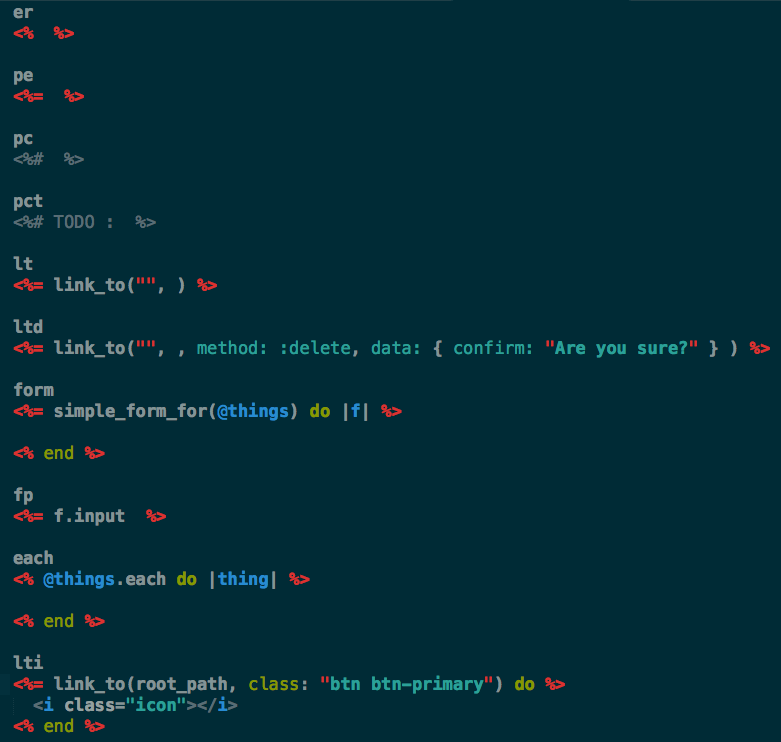

ERB-Sublime-Snippets
====================

A collection of [Sublime Text](http://www.sublimetext.com/) snippets useful for writing [ERB](http://ruby-doc.org/stdlib-1.9.3/libdoc/erb/rdoc/ERB.html)

## Edit by sdlong:

<table>
  <tr>
    <th>Tab Trigger</th>
    <th>Before</th>
    <th>After</th>
  </tr>
  <tr>
    <td>lt</td>
    <td>&lt;%= link_to $1, $2 %></td>
    <td>&lt;%= link_to("$1", $2) %></td>
  </tr>
  <tr>
    <td>ltd</td>
    <td>None</td>
    <td>&lt;%= link_to("$1", $2,   method: :delete, data: { confirm: "Are you sure?" } ) %></td>
  </tr>
  <tr>
    <td>form</td>
    <td>&lt;%= form_for(@$1 ) do |f| %>   $2  &lt;% end %></td>
    <td>&lt;%= simple_form_for(@$1 ) do |f| %>   $2   &lt;% end %></td>
  </tr>
  <tr>
    <td>fp</td>
    <td>None</td>
    <td>&lt;%= f.input $1 %></td>
  </tr>
  <tr>
    <td>each</td>
    <td>&lt;% @$1.each do |$2| %>  
        &lt;% end %></td>
    <td></td>
  </tr>
  <tr>
    <td>pct</td>
    <td>None</td>
    <td>&lt;%# TODO : $1 %></td>
  </tr>
  <tr>
    <td>lti</td>
    <td>None</td>
    <td>&lt;%= link_to(${1:root}_path, class: "${2:btn btn-primary}") do %>  &lt;/i> $0  
    </td>
  </tr>
</table>

##Installation

These snippets can now be installed via [Sublime Package Control](http://wbond.net/sublime_packages/package_control). If you do not use package control, simply checkout the source code into Sublime Text's packages directory. The location is system specific:

### For OSX

    $ cd ~/Library/Application\ Support/Sublime\ Text\ 2/Packages/
    $ git clone https://github.com/sdlong/ERB-Sublime-Snippets.git ERB\ Snippets

### For Windows

    $ cd %APPDATA%/Sublime Text 2/Packages/
    $ git clone https://github.com/sdlong/ERB-Sublime-Snippets.git ERB\ Snippets

### For Linux

    $ cd ~/.Sublime Text 2/Packages/
    $ git clone https://github.com/sdlong/ERB-Sublime-Snippets.git ERB\ Snippets

##Snippets and Bindings

<table>
  <tr>
    <th>Snippet</th>
    <th>Tab Trigger</th>
    <th>Output</th>
  </tr>
  <tr>
    <td>ERB tags</td>
    <td>__er__</td>
    <td>`<%  %>`</td>
  </tr>
  <tr>
    <td>print ERB tags</td>
    <td>__pe__</td>
    <td>`<%=  %>`</td>
  </tr>
  <tr>
    <td>print ERB comment</td>
    <td>__pc__</td>
    <td>`<%#  %>`</td>
  </tr>
  <tr>
    <td>`if` block</td>
    <td>__if__</td>
    <td>`<% if  %>...<% end %>`</td>
  </tr>
  <tr>
    <td>`if` / `else` block</td>
    <td>__ife__</td>
    <td>`<% if  %>...<% else %>...<% end %>`</td>
  </tr>
  <tr>
    <td>`else` tag</td>
    <td>__else__</td>
    <td>`<% else %>`</td>
  </tr>
  <tr>
    <td>`elsif` tag</td>
    <td>__elsif__</td>
    <td>`<% elsif %>`</td>
  </tr>
  <tr>
    <td>`unless` block</td>
    <td>__unless__</td>
    <td>`<% unless  %>...<% end %>`</td>
  </tr>
  <tr>
    <td>`end` block</td>
    <td>__end__</td>
    <td>`<% end %>`</td>
  </tr>
  <tr>
    <td>`submit_tag` helper</td>
    <td>__st__</td>
    <td>`<%= submit_tag ..., ... %>`</td>
  </tr>
  <tr>
    <td>`text_field_tag` helper</td>
    <td>__tft__</td>
    <td>`<%= text_field_tag ..., ... %>`</td>
  </tr>
  <tr>
    <td>`password_field_tag` helper</td>
    <td>__pft__</td>
    <td>`<%= password_field_tag ..., ... %>`</td>
  </tr>
  <tr>
    <td>`label_tag` helper</td>
    <td>__lblt__</td>
    <td>`<%= label_tag ..., ... %>`</td>
  </tr>
  <tr>
    <td>`link_to` helper</td>
    <td>__lt__</td>
    <td>`<%= link_to ..., ... %>`</td>
  </tr>
  <tr>
    <td>`form_for` helper</td>
    <td>__form__</td>
    <td>`<%= form_for(@ ) do |f| %> ... <% end %>`</td>
  </tr>
  <tr>
    <td>`t()` helper</td>
    <td>__t__</td>
    <td>`<%= t('@') %>`</td>
  </tr>
<table>

##Questions, Comments, Concerns?

Feel free to submit a pull request with any snippets you would like to add to the project. If you have any problems or suggestions you can contact me [on twitter](https://twitter.com/mattdrobertson).

##License

Released under [WTFPL, Version 2](https://raw.github.com/matthewrobertson/ERB-Sublime-Snippets/master/LICENSE.txt)
